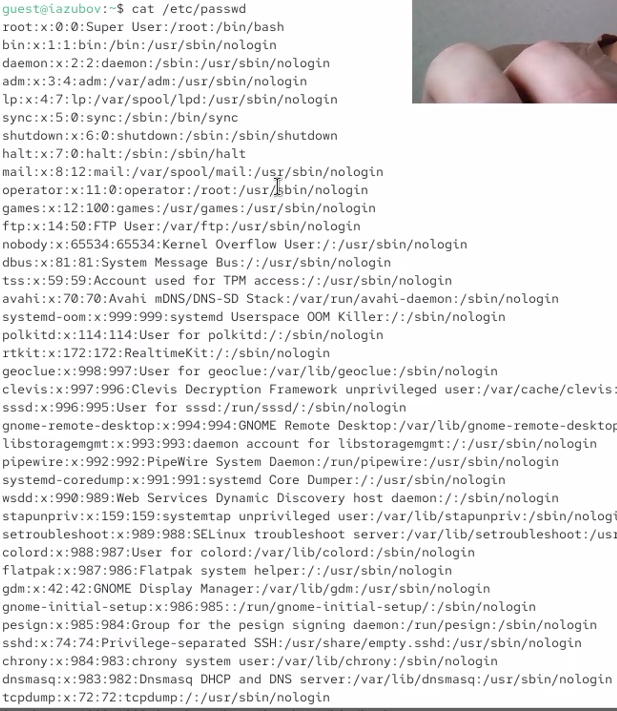

---
## Author
author:
  name: Зубов Иван Александрович
  degrees: DSc
  orcid: 0000-0002-0877-7063
  affiliation:
    - name: Российский университет дружбы народов
      country: Российская Федерация
      city: Москва
      address: ул. Миклухо-Маклая, д. 6
## Title
title: Лабораторная работа №2
subtitle: Презентация
license: CC BY
date: today
date-format: "YYYY-MM-DD" # Example: 2025-09-06
---

# Информация

## Докладчик

  * Зубов Иван Александрович
  * Студент
  * Российский университет дружбы народов им. П. Лумумбы

# Выполнение лабораторной работы

## Создаем учётную запись пользователя guest 

:::
::: {.column width="70%"}

:::
::::::::::::::

## Информация о  пользователе

:::
::: {.column width="70%"}

:::
::::::::::::::

## Смотрим файл

:::
::: {.column width="70%"}

:::
::::::::::::::

## Команда ls

:::
::: {.column width="70%"}

:::
::::::::::::::

## Атрибуты

Создаем в домашней директории поддиректорию dir1, снимаем там все атрибуты и пытаемся создать файл в этой директории

:::
::: {.column width="70%"}

:::
::::::::::::::

## Таблица

:::
::: {.column width="70%"}

:::
::::::::::::::

