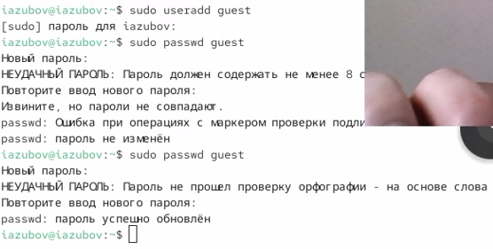
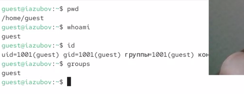
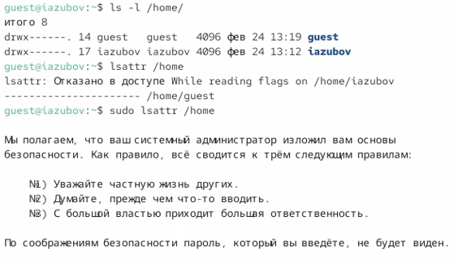
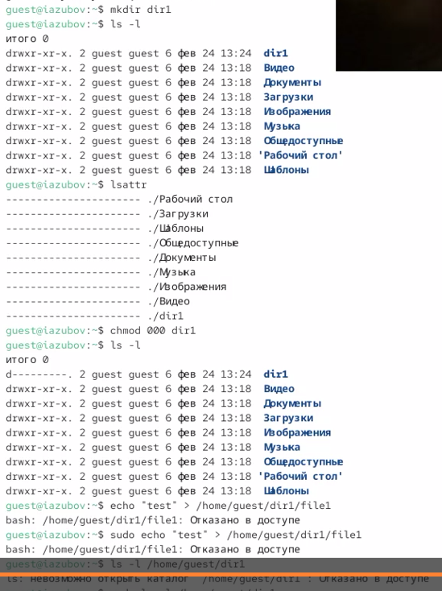

---
## Author
author:
  name: Зубов Иван Александрович
  degrees: DSc
  orcid: 0000-0002-0877-7063
  affiliation:
    - name: Российский университет дружбы народов
      country: Российская Федерация
      postal-code: 117198
      city: Москва
      address: ул. Миклухо-Маклая, д. 6

## Title
title: "Лабораторная работа №2"
subtitle: "Отчет"
license: "CC BY"
---

# Цель работы

Получение практических навыков работы в консоли с атрибутами файлов, закрепление теоретических основ дискреционного разграничения доступа в современных системах с открытым кодом на базе ОС Linux1.

# Выполнение лабораторной работы

Создаем учётную запись пользователя guest и задаем ему пароль

{#fig-001 width=70%}

Войдем в систему от имени пользователя guest. Вводим команду pwd и уточняем имя вашего пользователя, его группу, а также группы, куда входит пользователь, командой id. Сравниваем с командой groups 

{#fig-002 width=70%}

Просмотрим файл /etc/passwd командойcat /etc/passwd и находим информацию о пользователе

{#fig-003 width=70%}

Определим существующие в системе директории командой ls -l /home/ и проверим, какие расширенные атрибуты установлены на поддиректориях, находящихся в директории /home, командой:lsattr /home

{#fig-004 width=70%}

Создаем в домашней директории поддиректорию dir1, снимаем там все атрибуты и пытаемся создать файл в этой директории

{#fig-005 width=70%}

После всех операций,заполняем таблицы,используя инофрмацию о правах ,полученную в ходу выполнения лабораторной

{#fig-006 width=70%}

# Выводы

Я получил практические навыки работы в консоли с атрибутами файлов, закрепление теоретических основ дискреционного разграничения доступа в современных системах с открытым кодом на базе ОС Linux1.

