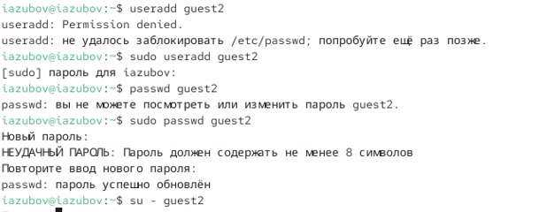
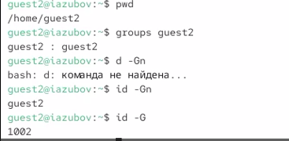
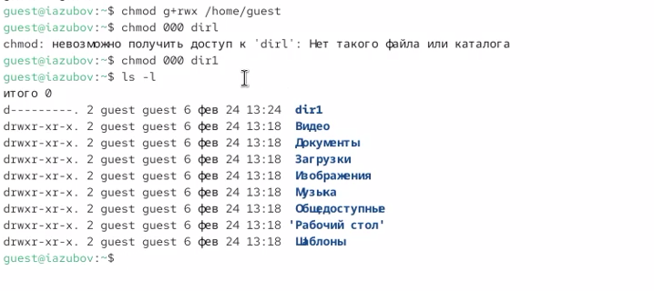

---
## Author
author:
  name: Зубов Иван Александрович
  degrees: DSc
  orcid: 0000-0002-0877-7063
  affiliation:
    - name: Российский университет дружбы народов
      country: Российская Федерация
      postal-code: 117198
      city: Москва
      address: ул. Миклухо-Маклая, д. 6

## Title
title: "Лабораторная работа №3"
subtitle: "Отчет"
license: "CC BY"
---

# Цель работы

Получение практических навыков работы в консоли с атрибутами файлов для групп пользователей.

# Выполнение лабораторной работы

Cоздаем учётную запись пользователя guest2 и задаем ему новый пароль.Осуществляем вход в guest2.

{#fig-001 width=70%}

Добавляем пользователя guest2 в группу guest

{#fig-002 width=70%}

Для обоих пользователей командой pwd определим директорию, в которой мы находитесь. Определим командами groups guest и groups guest2, в какие группы входят пользователи guest и guest2

{#fig-003 width=70%}

Сравним полученную информацию с содержимым файла /etc/group.Просмотрим файл командой
cat /etc/group

{#fig-004 width=70%}

От имени пользователя guest2 выполним регистрацию пользователя guest2 в группе guest

{#fig-005 width=70%}

От имени пользователя guest изменим права директории /home/guest, разрешив все действия для пользователей группы и снимем с директории /home/guest/dir1 все атрибуты 

{#fig-006 width=70%}

Меняя атрибуты у директории dir1 и файла file1 от имени пользователя guest и делая проверку от пользователя guest2, заполните,
определив опытным путём, какие операции разрешены, а какие нет. 

{#fig-007 width=70%}

# Выводы

Я получил практические навыки работы в консоли с атрибутами файлов для групп пользователей

