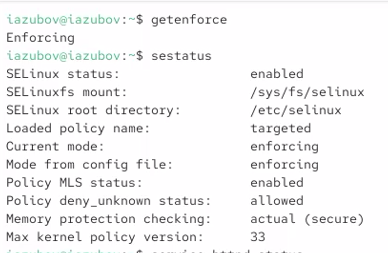
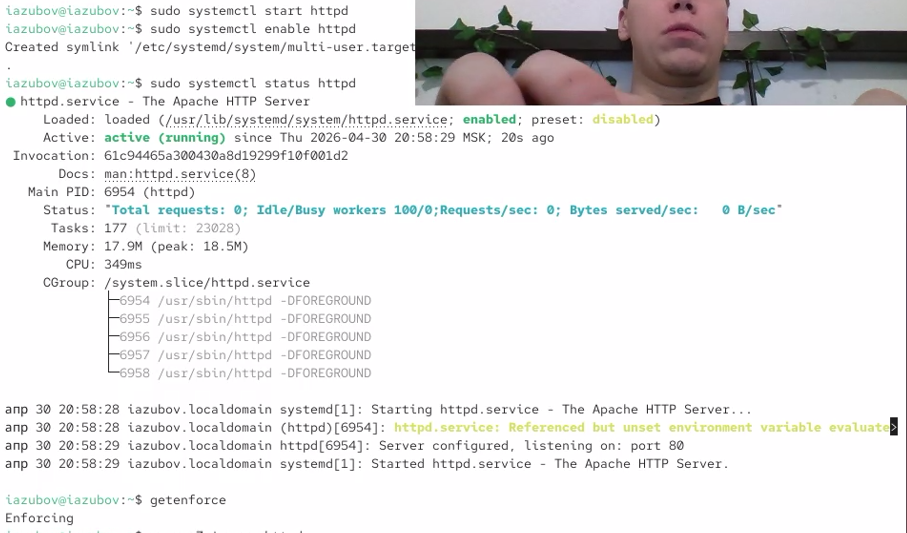
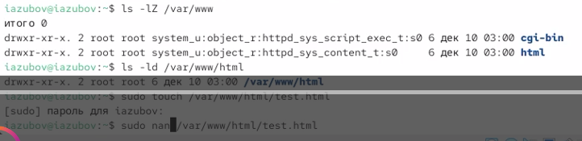
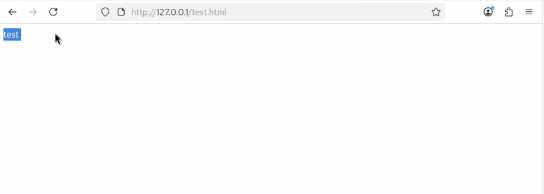
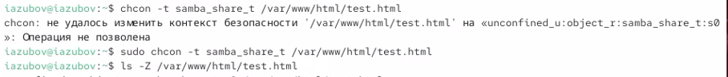
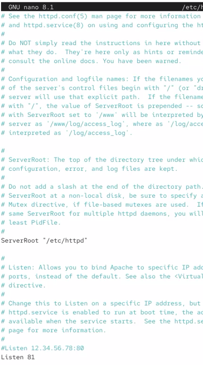
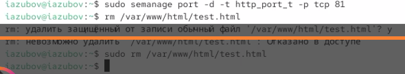

---
## Author
author:
  name: Зубов Иван Александрович
  degrees: DSc
  orcid: 0000-0002-0877-7063
  affiliation:
    - name: Российский университет дружбы народов
      country: Российская Федерация
      city: Москва
      address: ул. Миклухо-Маклая, д. 6
## Title
title: Индивидуальный проект №4
subtitle: Презентация
license: CC BY
date: today
date-format: "YYYY-MM-DD" # Example: 2025-09-06
---

# Информация

## Докладчик

  * Зубов Иван Александрович
  * Студент
  * Российский университет дружбы народов им. П. Лумумбы

# Выполнение лабораторной работы

## getenforce и sestatus.

:::

## Обратимся с помощью браузера к веб-серверу

:::

## Найдем веб-сервер Apache и информацию

:::

## Определяем типы файлов и создаем файл

:::

## Проверка

:::

## Права доступа

:::

## Запустим веб-сервер Apache на прослушивание ТСР-порта 81

:::

## список портов и контекст

:::

## Проверка сайта (test)

:::

## Удаляем привязку http_port_t к 81 порту.Удаляем файл /var/www/html/test.html

:::
