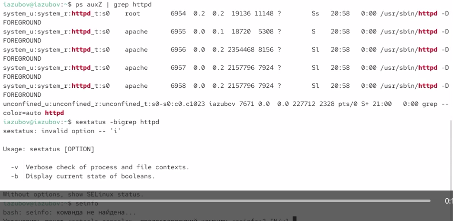
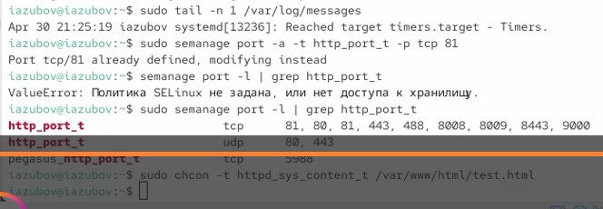
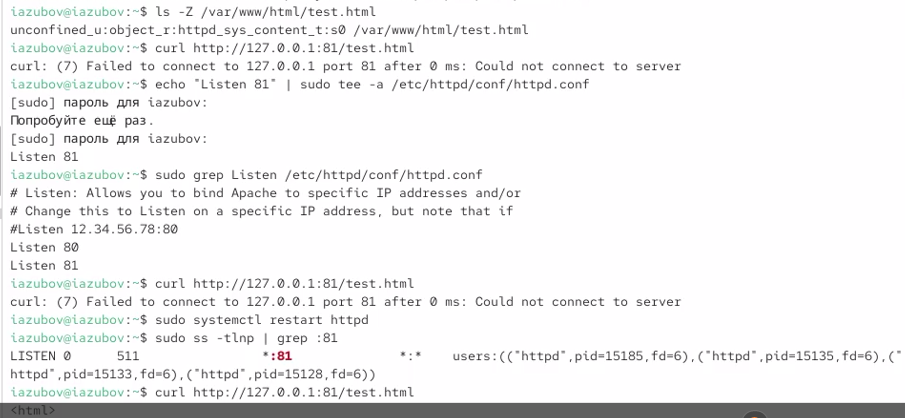

---
## Author
author:
  name: Зубов Иван Александрович
  degrees: DSc
  orcid: 0000-0002-0877-7063
  affiliation:
    - name: Российский университет дружбы народов
      country: Российская Федерация
      postal-code: 117198
      city: Москва
      address: ул. Миклухо-Маклая, д. 6

## Title
title: "Индивидуальный проект. Стадия №4"
subtitle: "Отчет"
license: "CC BY"
---

# Цель работы

Развить навыки администрирования ОС Linux. Получить первое практическое знакомство с технологией SELinux1.
Проверить работу SELinx на практике совместно с веб-сервером Apache.

# Выполнение лабораторной работы

Войдем в  систему с полученными учётными данными и убедимся, что SELinux работает в режиме enforcing политики targeted с помощью команд getenforce и sestatus.

{#fig-001 width=70%}

Обратимся с помощью браузера к веб-серверу, запущенному на нашем компьютере, и убедитесь, что последний работает

{#fig-002 width=70%}

Найдем веб-сервер Apache в списке процессов, определите его контекст безопасности и посмотрим текущее состояние переключателей SELinux для Apache с помощью команды sestatus -bigrep httpd
Также осмотрите статистику по политике с помощью команды seinfo, также определите множество пользователей, ролей, типов. 

{#fig-003 width=70%}

Определим тип файлов и поддиректорий, находящихся в директории /var/www, 
Определим тип файлов, находящихся в директории /var/www/html
Создаем файл и вводим туда содержимое из задания

{#fig-004 width=70%}

Обратимся к файлу через веб-сервер, введя в браузере адрес http://127.0.0.1/test.html. Убедитесь, что файл был успешно отображён.

{#fig-005 width=70%}

Изменим  контекст файла /var/www/html/test.html с httpd_sys_content_t на любой другой, к которому процесс httpd не
должен иметь доступа, например, на samba_share_t:
chcon -t samba_share_t /var/www/html/test.html
ls -Z /var/www/html/test.html

После этого на странице сайта мы увидим надпись Forbidden

{#fig-006 width=70%}

Запустим веб-сервер Apache на прослушивание ТСР-порта 81 (а не 80, как рекомендует IANA и прописано в /etc/services). Перезапуском мы добьемся ошибки

{#fig-007 width=70%}

Выполним команду
semanage port -a -t http_port_t -р tcp 81
После этого проверьте список портов командой
semanage port -l | grep http_port_t 
Вернем контекст httpd_sys_cоntent__t к файлу /var/www/html/ test.html:
chcon -t httpd_sys_content_t /var/www/html/test.html

{#fig-008 width=70%}

После этого попробуйте получить доступ к файлу через веб-сервер, вве-
дя в браузере адрес http://127.0.0.1:81/test.html.
Вы должны увидеть содержимое файла — слово «test».

{#fig-009 width=70%}

Удаляем привязку http_port_t к 81 порту.
Удаляем файл /var/www/html/test.html

{#fig-005 width=70%}

# Выводы

Я получил первое практическое знакомство с технологией SELinux1.
Я проверил работу SELinx на практике совместно с веб-сервером Apache.

