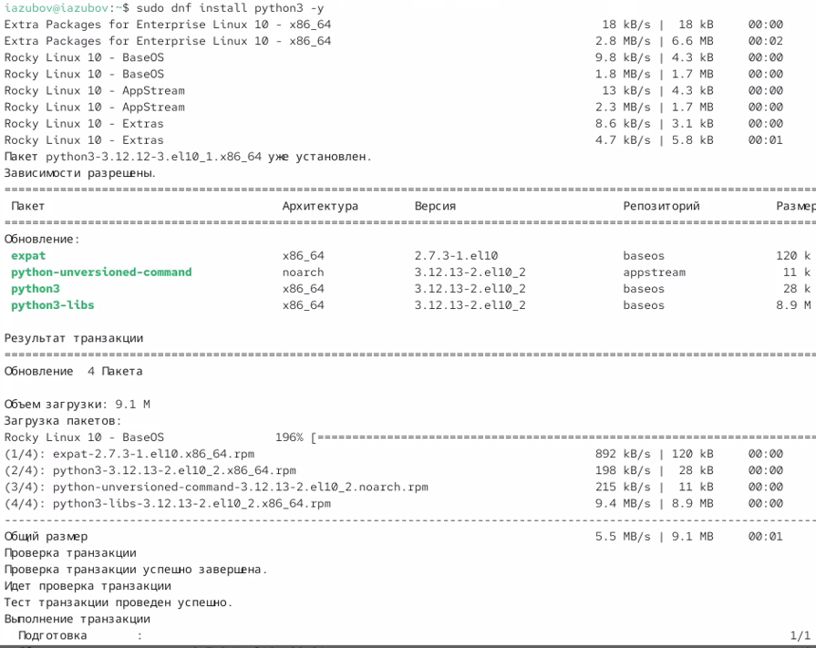
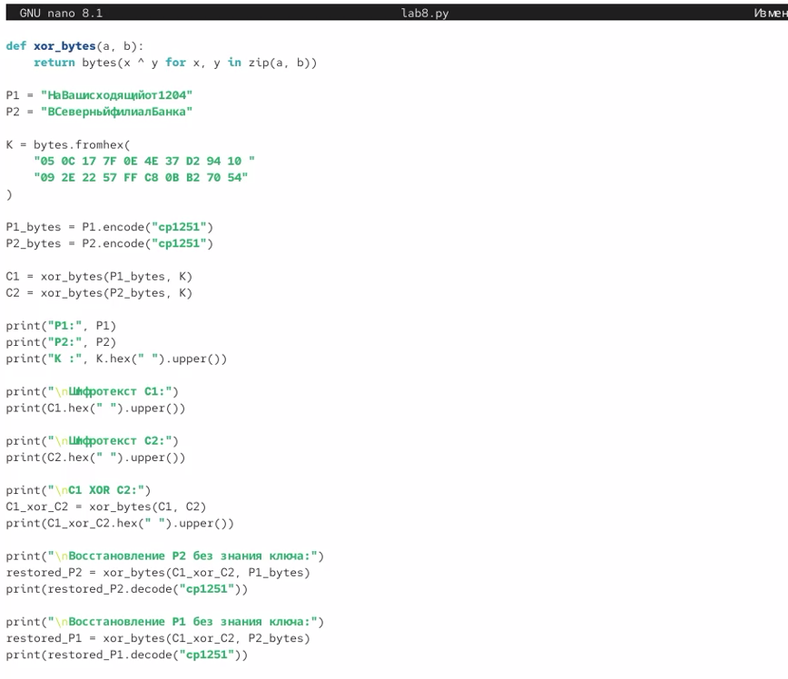
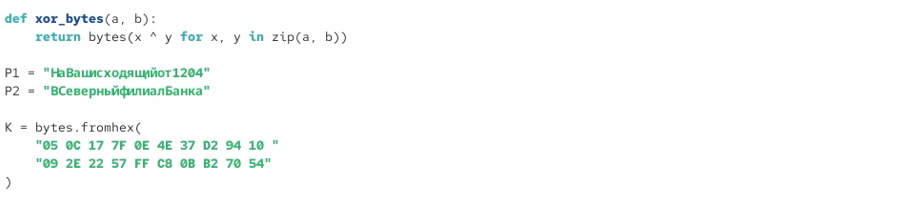
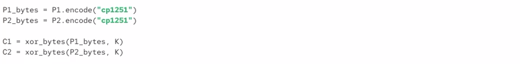
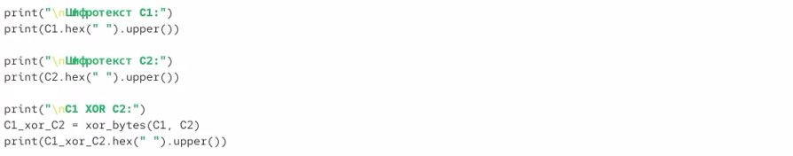
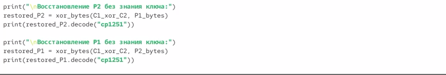
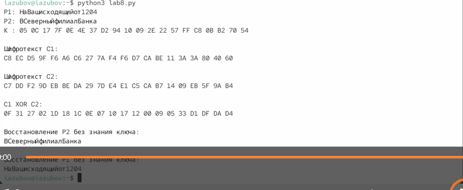

---
## Author
author:
  name: Зубов Иван Александрович
  degrees: DSc
  orcid: 0000-0002-0877-7063
  affiliation:
    - name: Российский университет дружбы народов
      country: Российская Федерация
      postal-code: 117198
      city: Москва
      address: ул. Миклухо-Маклая, д. 6

## Title
title: "Лабораторная работа №8"
subtitle: "Отчет"
license: "CC BY"
---

# Цель работы

Освоить на практике применение режима однократного гаммирования на примере кодирования различных исходных текстов одним ключом.

# Выполнение лабораторной работы

Устанавливаем Python для дальнейшей работы с этим язаком программирования  

{#fig-001 width=70%}

Используем команду nano для создания и редактирования файла Python

{#fig-002 width=70%}

Так выглядит написанный код, в котором написано приложение для однократного гаммирования, который дальше я подробно поясню 

{#fig-003 width=70%}

В этой функции реализована операция XOR (исключающее ИЛИ) для двух последовательностей байтов. Функция поочередно берет байты из двух массивов и выполняет над ними XOR. Результат используется как при шифровании, так и при расшифровании.

Дальше задаются два открытых текста из условия лабораторной работы. Именно эти сообщения необходимо зашифровать одним и тем же ключом.

А также ключ шифрования в шестнадцатеричном формате. Метод fromhex() преобразует последовательность шестнадцатеричных чисел в массив байтов.

{#fig-004 width=70%}

Операция XOR работает только с числами. Поэтому текст необходимо сначала перевести в байтовое представление. Для русских символов используется кодировка CP1251.

И выполняем шифрование по формуле однократного гаммирования:

{#fig-005 width=70%}

Шифротексты выводятся в шестнадцатеричном виде для удобства анализа и сравнения результатов.

{#fig-006 width=70%}

Предположим, злоумышленник знает текст P1. Тогда он может найти второй текст без знания ключа.В программе выполняется именно эта операция: restored_P2 = xor_bytes(C1_xor_C2, P1_bytes). Аналогично и с P2 

{#fig-007 width=70%}

Запуская наш файл и смотри результат.

{#fig-008 width=70%}

# Выводы

В ходе лабораторной работы был изучен режим однократного гаммирования и реализовано шифрование двух сообщений одним ключом. Были получены шифротексты C1 и C2 и показана уязвимость повторного использования ключа.

# Контрольные вопросы
1. Как, зная один из текстов (P1 или P2), определить другой, не зная при этом ключа? Если известен один открытый текст, то второй можно найти по формуле:P2 = C1 ⊕ C2 ⊕ P1

2. Что будет при повторном использовании ключа при шифровании текста? Повторное использование ключа снижает безопасность и позволяет злоумышленнику получить информацию об открытых текстах.

3. Как реализуется режим шифрования однократного гаммирования одним ключом двух открытых текстов? Каждый открытый текст складывается по модулю 2 (XOR) с одним и тем же ключом: C1 = P1 ⊕ K, C2 = P2 ⊕ K. 

4. Перечислите недостатки шифрования одним ключом двух открытых текстов.
Снижается криптостойкость.
Можно получить связь между сообщениями.
При знании одного текста можно восстановить другой.
Возможен криптоанализ без определения ключа.

5. Перечислите преимущества шифрования одним ключом двух открытых
текстов.
Простота реализации.
Высокая скорость шифрования.
Небольшие вычислительные затраты.
Удобство использования одного ключа для шифрования данных.

