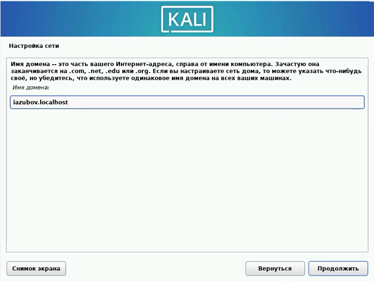
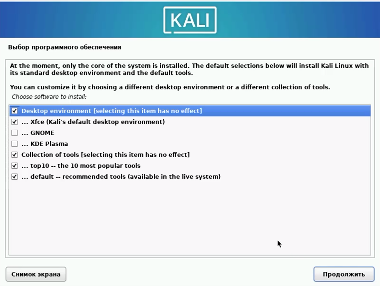
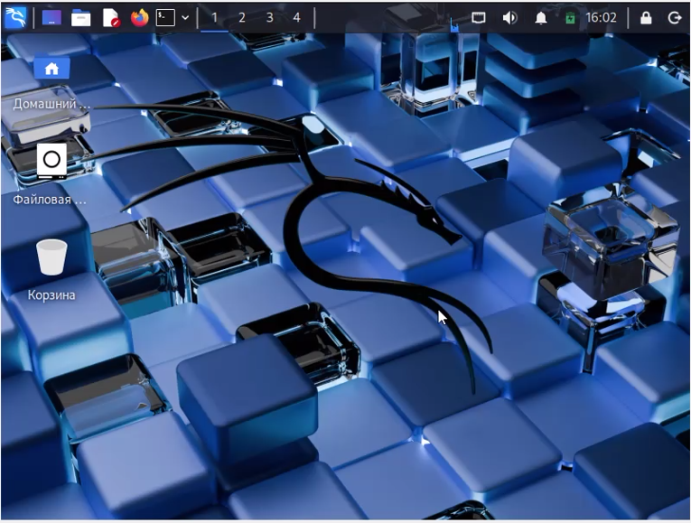

---
## Author
author:
  name: Зубов Иван Александрович
  degrees: DSc
  orcid: 0000-0002-0877-7063
  affiliation:
    - name: Российский университет дружбы народов
      country: Российская Федерация
      city: Москва
      address: ул. Миклухо-Маклая, д. 6
## Title
title: Индивидуальный проект. Стадия 1
subtitle: Презентация
license: CC BY
date: today
date-format: "YYYY-MM-DD" # Example: 2025-09-06
---

# Информация

## Докладчик

  * Зубов Иван Александрович
  * Студент
  * Российский университет дружбы народов им. П. Лумумбы

# Выполнение лабораторной работы

## Создаем  виртуальную машину.

:::

## Первоначальный экран Kali

:::

## Русская раскладка и местонахождение

:::

## Вводим имя пользователя

:::

## Настраиваем сеть

:::

## Настраиваем учетную запись и задаем пароль

:::

## Разметка диска

:::

## Записываем изменения на диск

:::

## Выбираем программное обеспечение.

:::

## Вводим имя пользователя

:::

## Рабочий экран Kali

:::

