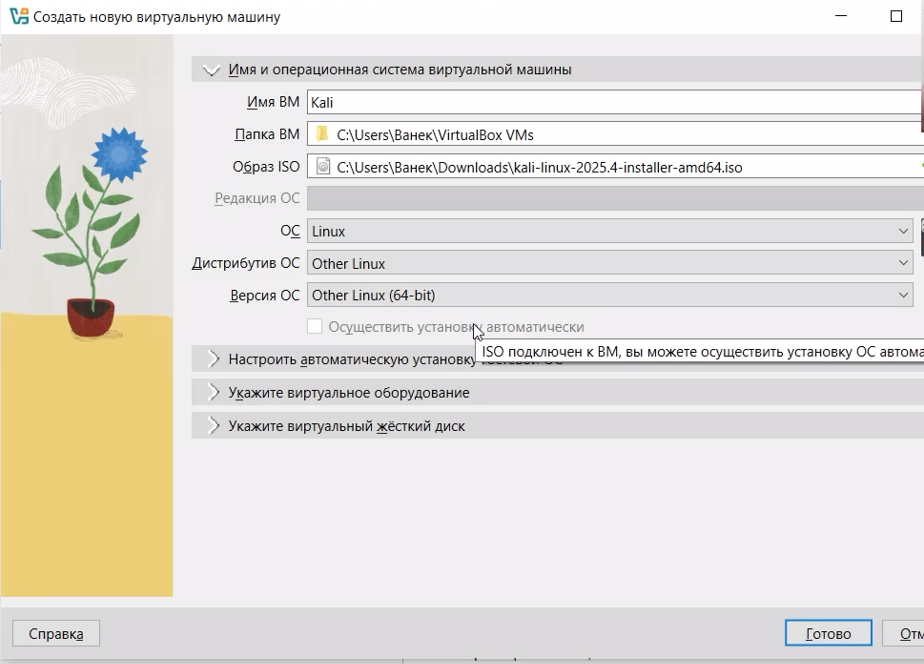
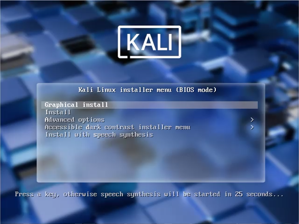
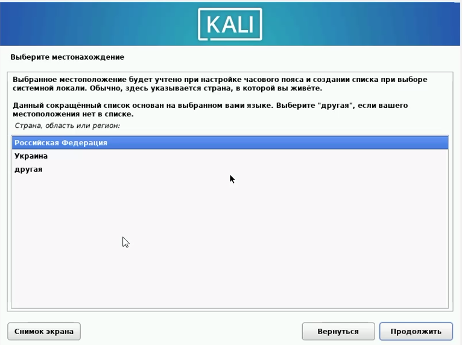
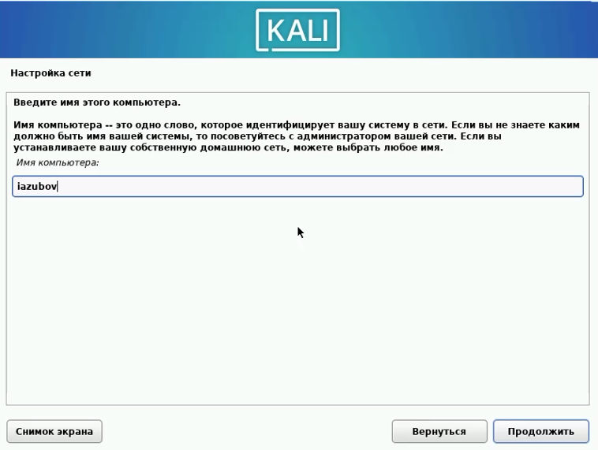
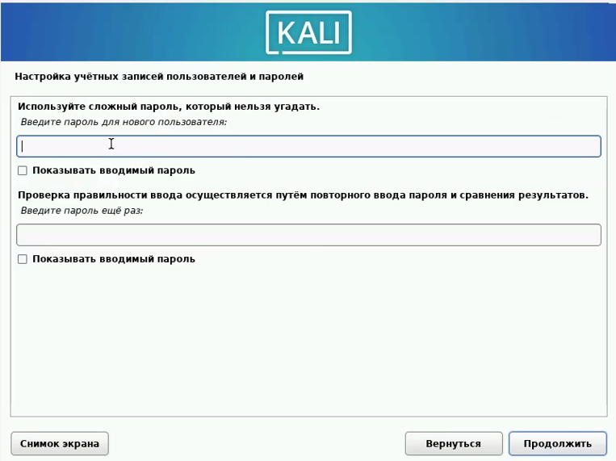
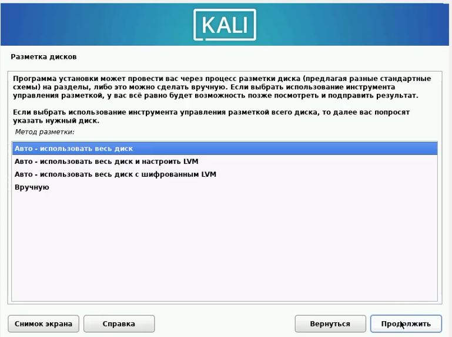
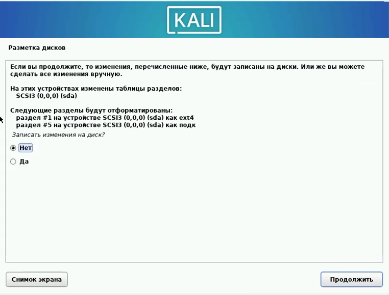
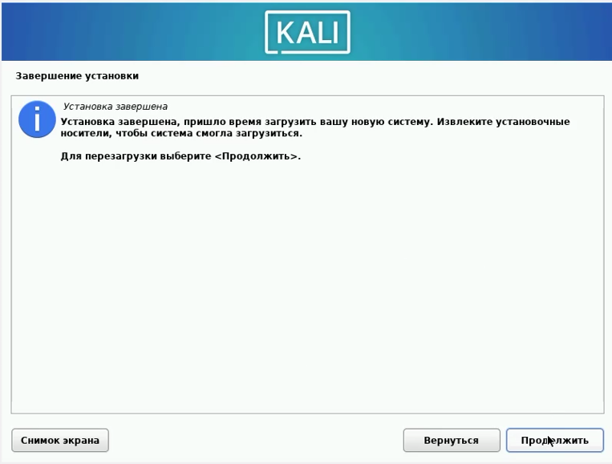

---
## Author
author:
  name: Зубов Иван Александрович
  degrees: DSc
  orcid: 0000-0002-0877-7063
  affiliation:
    - name: Российский университет дружбы народов
      country: Российская Федерация
      postal-code: 117198
      city: Москва
      address: ул. Миклухо-Маклая, д. 6

## Title
title: "Индивидуальный проект. Стадия 1"
subtitle: "Отчет"
license: "CC BY"
---

# Цель работы

Создай новую виртуальную машину Linux Kali

# Выполнение лабораторной работы

Создаем  виртуальную машину.Выбираем образ диска Kali. Задаем имя,выделяем память на диске и ЦПУ

{#fig-001 width=70%}

Высвечивается первоначальный экран Kali, где мы нажимаем Grafical Install

{#fig-002 width=70%}

Выбираем русскую раскладку калвиатуры,местонахождения-РФ и московское время

{#fig-003 width=70%}

Вводим имя пользователя своего

{#fig-004 width=70%}

Настраиваем сеть

{#fig-005 width=70%}

Настраиваем учетную запись и задаем пароль

{#fig-006 width=70%}

Размечаем диск. Вводим все изменения и выбираем диск,где будет все хранится

{#fig-007 width=70%}

Записываем изменения на диск

{#fig-008 width=70%}

Выбираем программное обеспечение. Оставляем все по умолчанию

{#fig-009 width=70%}

Завершаем загрузку и перезагружаем систему

{#fig-010 width=70%}

После перезагрузки нас вcтречает рабочий экран Kali

{#fig-011 width=70%}

# Выводы

Мы успешно установили Kali Linux

