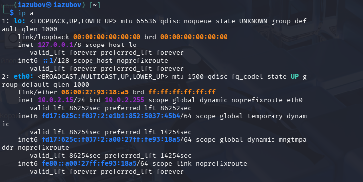
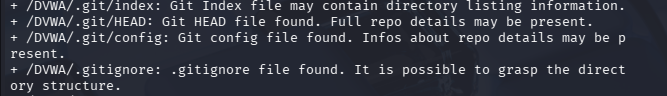

---
## Author
author:
  name: Зубов Иван Александрович
  degrees: DSc
  orcid: 0000-0002-0877-7063
  affiliation:
    - name: Российский университет дружбы народов
      country: Российская Федерация
      postal-code: 117198
      city: Москва
      address: ул. Миклухо-Маклая, д. 6

## Title
title: "Индивидуальный проект. Стадия №4"
subtitle: "Отчет"
license: "CC BY"
---

# Цель работы

Провести сканирование веб-сервера DVWA c использованием nikto. Выявить опасные настройки и файлы.

# Выполнение лабораторной работы

Узнаем ip адрес для дальнейшей работы с nikto.

{#fig-001 width=70%}

Выполним базовое сканирование  с помощью nikto и проанализируем вывод команды 

{#fig-002 width=70%}

Результаты для представленного ряда строк на фото таковы:
Заголовок X-Frame-Options не установлен, что делает приложение уязвимым к атакам Clickjacking — злоумышленник может встроить страницу в невидимый фрейм и обманом заставить пользователя выполнить нежелательные действия. Отсутствие заголовка X-Content-Type-Options позволяет браузеру неправильно определять тип файлов (MIME-сниффинг), из-за чего вредоносный код может быть выполнен под видом изображения или другого безопасного файла. Также не установлен заголовок X-XSS-Protection, что повышает риск успешного внедрения и выполнения межсайтовых скриптов (XSS-атак).

{#fig-003 width=70%}

Обнаружено несколько директорий с включённым индексным просмотром (Directory Indexing): /DVWA/config/, /DVWA/tests/, /DVWA/database/ и /DVWA/docs/. Это означает, что любой пользователь может открыть эти папки в браузере и увидеть полный список файлов. Особую опасность представляют директории config/ (может содержать файлы с паролями от базы данных) и database/ (файлы базы данных), а также tests/

{#fig-004 width=70%}

Обнаружены следующие Git-файлы: /DVWA/.git/index, /DVWA/.git/HEAD, /DVWA/.git/config, а также файлы .gitignore и .dockerignore. Присутствие этих файлов на рабочем веб-сервере является грубой ошибкой конфигурации, поскольку любой пользователь может получить к ним доступ через браузер.
Из этих файлов злоумышленник может извлечь ценную информацию: структуру директорий проекта, историю изменений, комментарии разработчиков, а в некоторых случаях — пароли или ключи, случайно добавленные в репозиторий.

{#fig-005 width=70%}

# Выводы

В ходе сканирования DVWA с помощью Nikto выявлены отсутствие защитных HTTP-заголовков, открытый доступ к директориям config/, database/, tests/, docs/ и наличие Git-файлов,что подвержает небезопасную конфигурацию веб-сервера

